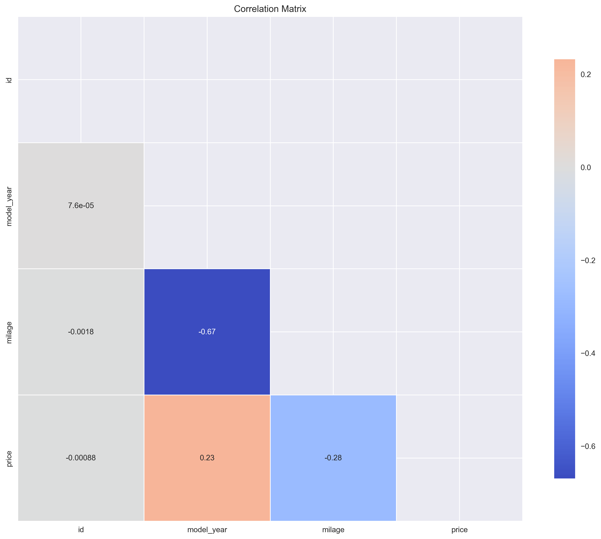
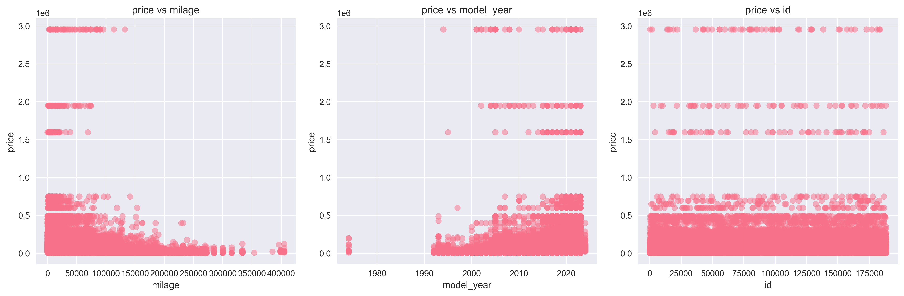
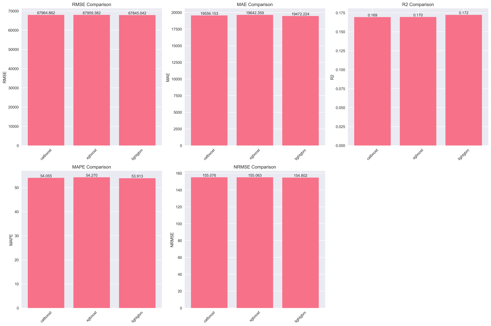
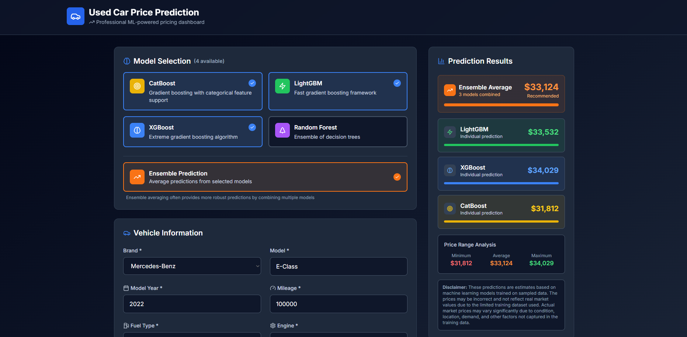
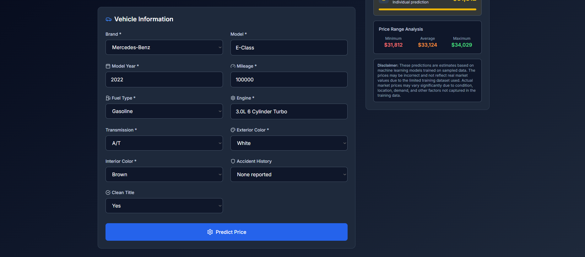

# Used Car Price Prediction Dashboard

A comprehensive machine learning web application that predicts used car prices using multiple ensemble models. This project demonstrates advanced data science techniques, full-stack development, and modern web technologies.

## ⚠️ Important Notice

**This is a prototype application.** The price predictions are not real market values and should not be used for actual car purchasing decisions. All predictions are based on a sampled dataset from Kaggle and may not reflect current market conditions or real-world pricing factors.

**Dataset Source:** [Kaggle Playground Series S4E9](https://www.kaggle.com/competitions/playground-series-s4e9/data)

## 🎯 Project Overview

This application combines machine learning expertise with modern web development to create an interactive dashboard for used car price prediction. The system employs multiple ensemble models (XGBoost, CatBoost, LightGBM, and Random Forest) to provide accurate price estimates with comprehensive analysis and visualization.

## 🏗️ Architecture

### Backend (Python/FastAPI)
- **Machine Learning Pipeline**: Complete ML workflow from data preprocessing to model deployment
- **Multiple Model Support**: XGBoost, CatBoost, LightGBM, Random Forest with ensemble capabilities
- **Hyperparameter Optimization**: Automated tuning using Optuna
- **RESTful API**: FastAPI-based API with comprehensive endpoints
- **Data Analysis**: Automated EDA with visualization generation

### Frontend (Next.js/TypeScript)
- **Modern UI**: Responsive design with Tailwind CSS
- **Real-time Predictions**: Interactive form with live model selection
- **Model Comparison**: Side-by-side prediction analysis
- **Error Handling**: Comprehensive user feedback and validation

## 📊 Key Features

### Machine Learning
- **Ensemble Methods**: Combines multiple models for improved accuracy
- **Feature Engineering**: Advanced preprocessing and categorical encoding
- **Model Evaluation**: Comprehensive metrics (RMSE, MAE, R², MAPE, NRMSE)
- **Hyperparameter Tuning**: Automated optimization for best performance

### Web Application
- **Interactive Dashboard**: User-friendly interface for price prediction
- **Model Selection**: Choose individual models or ensemble predictions
- **Real-time Results**: Instant predictions with detailed analysis
- **Responsive Design**: Works seamlessly across all devices

### Data Analysis
- **Automated EDA**: Comprehensive exploratory data analysis
- **Visualization**: Professional charts and graphs for data insights
- **Statistical Analysis**: Detailed correlation and distribution analysis

## 🚀 Quick Start

### Prerequisites
- Python 3.8+
- Node.js 16+
- npm or yarn

### Backend Setup
```bash
cd backend
pip install -r requirements.txt
python train_pipeline.py
uvicorn main:app --host 0.0.0.0 --port 8000 --reload
```

### Frontend Setup
```bash
cd frontend
npm install
npm run dev
```

### Access the Application
- **Frontend**: http://localhost:3000
- **Backend API**: http://localhost:8000
- **API Documentation**: http://localhost:8000/docs

## 📈 Model Performance

The application uses four different machine learning models, each optimized through hyperparameter tuning:

| Model | Description | Key Features |
|-------|-------------|--------------|
| **XGBoost** | Extreme Gradient Boosting | High accuracy, handles missing values |
| **CatBoost** | Categorical Boosting | Excellent with categorical features |
| **LightGBM** | Light Gradient Boosting | Fast training, memory efficient |
| **Random Forest** | Ensemble of Decision Trees | Robust, handles overfitting well |

## 🔧 Technical Implementation

### Data Processing Pipeline
1. **Data Loading**: Automated loading and validation
2. **Feature Engineering**: Age calculation, risk assessment, categorical encoding
3. **Preprocessing**: Missing value handling, normalization
4. **Model Training**: Multi-model training with validation
5. **Evaluation**: Comprehensive performance metrics

### API Endpoints
- `GET /health` - System health check
- `GET /available_models` - List trained models
- `POST /predict` - Make price predictions
- `GET /model_info/{model_name}` - Model details

### Frontend Components
- **ModelSelector**: Dynamic model loading and selection
- **CarForm**: Comprehensive vehicle information input
- **PredictionResults**: Real-time results with analysis
- **Error Handling**: User-friendly error messages

## 📊 Data Analysis Insights

The application includes comprehensive exploratory data analysis:


*Price distribution analysis showing the range and patterns in the dataset*


*Feature correlation analysis revealing relationships between variables*


*Feature importance analysis showing which factors most influence car prices*


*Comparative analysis of different model performances*

## 🖥️ Application Screenshots


*Main dashboard interface showing model selection and prediction results*


*Detailed prediction results with ensemble analysis and price range*

## 🛠️ Technologies Used

### Backend
- **Python 3.8+**: Core programming language
- **FastAPI**: Modern web framework for APIs
- **Scikit-learn**: Machine learning library
- **XGBoost, CatBoost, LightGBM**: Advanced ML algorithms
- **Optuna**: Hyperparameter optimization
- **Pandas, NumPy**: Data manipulation
- **Joblib**: Model serialization

### Frontend
- **Next.js 13**: React framework with App Router
- **TypeScript**: Type-safe JavaScript
- **Tailwind CSS**: Utility-first CSS framework
- **Lucide React**: Modern icon library

### Development Tools
- **Git**: Version control
- **ESLint, Prettier**: Code quality and formatting
- **Jupyter Notebooks**: Data analysis and prototyping

## 📁 Project Structure

```
Used-Car-Price-Prediction-Dashboard/
├── backend/
│   ├── services/                    # ML services and utilities
│   │   ├── data_loader.py          # Data loading and preprocessing
│   │   ├── eda.py                  # Exploratory data analysis
│   │   ├── preprocessing.py        # Feature engineering
│   │   ├── hyperparameter_tuning.py # Model optimization
│   │   ├── train.py                # Model training
│   │   ├── evaluate.py             # Model evaluation
│   │   └── predict.py              # Prediction service
│   ├── models/                     # Trained model files
│   │   ├── CatBoostRegressor.pkl
│   │   ├── XGBRegressor.pkl
│   │   ├── LGBMRegressor.pkl
│   │   └── RandomForestRegressor.pkl
│   ├── imgs/                       # Generated EDA visualizations
│   ├── jsons_for_test/             # API test files
│   ├── model_params/               # Hyperparameter configurations
│   ├── submission/                 # Model predictions output
│   ├── main.py                     # FastAPI application
│   ├── train_pipeline.py           # ML training pipeline
│   ├── quick_train.py              # Fast training script
│   ├── requirements.txt            # Python dependencies
│   └── README.md                   # Backend documentation
├── frontend/
│   ├── src/
│   │   ├── app/                    # Next.js app directory
│   │   │   ├── globals.css
│   │   │   ├── layout.tsx
│   │   │   └── page.tsx
│   │   ├── components/             # React components
│   │   │   ├── CarForm.tsx
│   │   │   ├── Header.tsx
│   │   │   ├── ModelSelector.tsx
│   │   │   └── PredictionResults.tsx
│   │   ├── lib/                    # API services and utilities
│   │   │   ├── api.ts
│   │   │   └── utils.ts
│   │   ├── config/                 # Configuration files
│   │   │   └── api.ts
│   │   └── types/                  # TypeScript definitions
│   │       └── index.ts
│   ├── package.json                # Node.js dependencies
│   ├── tailwind.config.js          # Tailwind CSS configuration
│   ├── tsconfig.json               # TypeScript configuration
│   └── INTEGRATION.md              # Frontend-backend integration guide
├── data/                           # Dataset files
│   ├── train.csv
│   ├── test.csv
│   └── sample_submission.csv
├── imgs/                           # Application screenshots
├── submission/                     # Final model predictions
├── notebook.ipynb                  # Jupyter notebook for analysis
└── README.md                       # Project documentation
```

## 🎯 Key Achievements

- **Full-Stack Development**: Complete web application from data to deployment
- **Advanced ML Pipeline**: Sophisticated machine learning workflow
- **Model Ensemble**: Multiple algorithms working together for better accuracy
- **Professional UI/UX**: Modern, responsive user interface
- **Comprehensive Testing**: Thorough validation and error handling
- **Documentation**: Complete technical documentation

## 🔮 Future Enhancements

- **Real-time Data Integration**: Connect to live car market APIs
- **Advanced Features**: Additional vehicle specifications
- **Model Retraining**: Automated model updates
- **Deployment**: Cloud deployment with CI/CD pipeline
- **Mobile App**: Native mobile application

## 📝 License

This project is for educational and demonstration purposes. Please refer to the Kaggle dataset license for data usage terms.

## 🤝 Contributing

This is a portfolio project demonstrating technical skills. For questions or feedback, please reach out through the contact information provided.

---

**Note**: This application is a prototype for demonstration purposes. All predictions are based on sampled training data and should not be used for actual car purchasing decisions.
