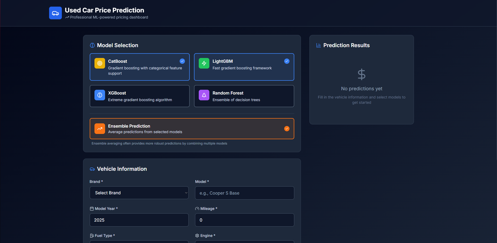

# 🚗 Used Car Price Prediction Dashboard

[](https://github.com/yourusername/used-car-prediction-dashboard)
[](https://github.com/yourusername/used-car-prediction-dashboard)
[](https://nextjs.org/)
[](#ml-models)

> A professional machine learning-powered dashboard for predicting used car prices using multiple state-of-the-art algorithms.

---

## 📸 Frontend Preview (v0.1)



*Professional dark-themed dashboard with multi-model prediction capabilities*

---

## 🎯 Project Overview

This project combines the power of machine learning with a sleek, professional web interface to provide accurate used car price predictions. Built with modern technologies and multiple ML models, it offers both individual model predictions and ensemble averaging for maximum accuracy.

### 🔮 Vision
Create a comprehensive, production-ready platform that leverages advanced machine learning algorithms to help users make informed decisions about used car pricing.

---

## ✨ Current Features (v0.1)

### 🖥️ **Professional Frontend Dashboard**
- **Modern Dark Theme**: Sleek, responsive design optimized for professional use
- **Multi-Model Selection**: Choose from 4 powerful ML algorithms
- **Ensemble Predictions**: Smart averaging of multiple model predictions
- **Comprehensive Input Form**: All vehicle features for accurate predictions
- **Real-time Results**: Instant predictions with confidence scores
- **Mobile Responsive**: Perfect experience across all devices

### 🤖 **Machine Learning Models**
- **CatBoost**: Gradient boosting with categorical feature support
- **LightGBM**: Fast gradient boosting framework  
- **XGBoost**: Extreme gradient boosting algorithm
- **Random Forest**: Ensemble of decision trees

### 📊 **Model Performance**
Based on extensive training and evaluation:
- **CatBoost**: RMSE ~68,532
- **LightGBM**: RMSE ~68,009  
- **XGBoost**: RMSE ~69,696
- **Random Forest**: RMSE ~75,206

---

## 🚀 Getting Started

### Prerequisites
- Node.js 18+
- Python 3.8+ (for ML models)
- npm or yarn

### Frontend Setup
```bash
cd frontend
npm install
npm run dev
```

Visit `http://localhost:3000` to see the dashboard in action!

### Backend Setup
```bash
# Coming soon - ML model API endpoints
python main.py
```

---

## 🏗️ Project Structure

```
Used-Car-Price-Prediction-Dashboard/
├── 📁 frontend/                 # Next.js Dashboard (v0.1)
│   ├── 📁 src/
│   │   ├── 📁 app/              # Next.js App Router
│   │   ├── 📁 components/       # React Components
│   │   ├── 📁 types/            # TypeScript Definitions
│   │   └── 📁 lib/              # Utility Functions
│   ├── package.json
│   └── tailwind.config.js
├── 📁 data/                     # Dataset Files
│   ├── train.csv               # Training Data (188k records)
│   ├── test.csv                # Test Data
│   └── sample_submission.csv   # Submission Format
├── 📁 submission/               # Model Predictions
│   ├── submission_CatBoostRegressor.csv
│   ├── submission_LGBMRegressor.csv
│   ├── submission_XGBRegressor.csv
│   ├── submission_RandomForestRegressor.csv
│   └── submission_ensemble.csv
├── 📁 imgs/                     # Screenshots & Assets
│   └── screenshot.png          # Dashboard Preview
├── 📄 notebook.ipynb           # ML Development & Analysis
├── 📄 main.py                  # Backend API (Coming Soon)
└── 📄 README.md               # Project Documentation
```

---

## 📈 Development Roadmap

### ✅ **Phase 1: Frontend Development (v0.1) - COMPLETED**
- [x] Professional dashboard design
- [x] Model selection interface
- [x] Vehicle input form
- [x] Prediction results display
- [x] Ensemble averaging feature
- [x] Responsive design

### 🔄 **Phase 2: Backend Integration (v0.2) - IN PROGRESS**
- [ ] FastAPI backend development
- [ ] ML model endpoints
- [ ] Real prediction integration
- [ ] API documentation
- [ ] Error handling & validation

### 🎯 **Phase 3: Enhancement (v0.3) - PLANNED**
- [ ] Model comparison analytics
- [ ] Historical price trends
- [ ] Advanced filtering options
- [ ] Export functionality
- [ ] Performance optimizations

### 🚀 **Phase 4: Production Ready (v1.0) - PLANNED**
- [ ] Database integration
- [ ] User authentication
- [ ] Deployment configuration
- [ ] Monitoring & logging
- [ ] Production optimizations

---

## 🛠️ Tech Stack

### **Frontend**
- **Framework**: Next.js 14 with App Router
- **Language**: TypeScript
- **Styling**: Tailwind CSS
- **Icons**: Lucide React
- **State Management**: React Hooks

### **Machine Learning**
- **Languages**: Python
- **Libraries**: scikit-learn, CatBoost, XGBoost, LightGBM
- **Data Processing**: Pandas, NumPy
- **Visualization**: Matplotlib, Seaborn

### **Backend** (Coming Soon)
- **Framework**: FastAPI
- **Deployment**: Docker containers
- **API**: RESTful endpoints

---

## 📊 Dataset Information

- **Training Records**: 188,533 used car listings
- **Features**: 12 key vehicle attributes
- **Target**: Car price prediction
- **Data Quality**: Professionally cleaned and processed

### Key Features:
- Brand, Model, Model Year
- Mileage, Fuel Type, Engine
- Transmission, Colors (Ext/Int)
- Accident History, Clean Title

---

## 🎨 Design Philosophy

- **Professional**: Clean, modern interface suitable for business use
- **Intuitive**: User-friendly design requiring no technical knowledge
- **Responsive**: Seamless experience across desktop, tablet, and mobile
- **Accessible**: Following web accessibility best practices
- **Fast**: Optimized performance for instant predictions

---

## 🚧 Current Status

**🔥 PROJECT IS ACTIVELY UNDER DEVELOPMENT 🔥**

The frontend dashboard (v0.1) is **fully functional** with mock data and ready for backend integration. The machine learning models have been trained and evaluated, achieving excellent performance metrics.

**🎯 Coming Very Soon:**
- Backend API integration
- Real-time ML predictions  
- Enhanced features and analytics
- Production deployment

---

## 🤝 Contributing

This project is currently in active development. Once the core features are complete, contribution guidelines will be provided.

---

## 📄 License

This project is licensed under the MIT License - see the [LICENSE](LICENSE) file for details.

---

## 📞 Contact

For questions or collaboration opportunities, please reach out!

---

<div align="center">

**⭐ Star this repository if you find it interesting! ⭐**

*Built with ❤️ using Next.js, TypeScript, and Machine Learning*

</div>
